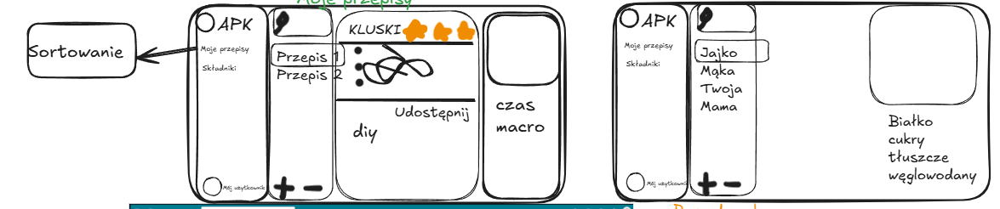

# 🍽️ DobrePAPu - Menadżer Przepisów Kulinarnych

## 📖 O projekcie
**DobrePAPu** to projekt desktopowej aplikacji ułatwiającej gromadzenie, organizację oraz analizę ulubionych przepisów kulinarnych. Naszym celem jest stworzenie intuicyjnego narzędzia, które nie tylko przechowa receptury, ale również dostarczy szczegółowych informacji o wartościach odżywczych każdego posiłku.

## ✨ Główne funkcjonalności

### 🥗 Zarządzanie przepisami
* **Baza przepisów:** Dodawanie, edytowanie i usuwanie własnych przepisów.
* **Segregacja i tagi:** Łatwe wyszukiwanie po tagach (np. *zupa*, *deser*, *wegańskie*).
* **Szczegóły receptury:** Każdy przepis zawiera:
  * Liczbę porcji,
  * Czas przygotowania,
  * Listę kroków / instrukcję przygotowania (DIY),
  * System oceniania w skali 1-5 gwiazdek (⭐),
  * Miejsce na zdjęcie potrawy,
  * Listę składników.

### 🥑 Baza składników
* Rozbudowana baza składników z przypisanymi wartościami odżywczymi.
* Automatyczne zliczanie makroskładników dla każdego posiłku, w tym:
  * Białka,
  * Węglowodanów (w tym cukrów),
  * Tłuszczów,
  * Kalorii.

### 🖥️ Interfejs Użytkownika (GUI)
Aplikacja opiera się na przejrzystym, trójkolumnowym układzie, zapewniającym wygodę użytkowania (wygląd bazujący na interfejsach Outlook i Ania Gotuje). Ekran dzielimy na panele:
1. **Panel nawigacyjny (lewy):** Szybki dostęp do głównych widoków ("Moje przepisy", "Składniki"), profilu użytkownika oraz narzędzi do sortowania.
2. **Panel listy (środkowy):** Pasek wyszukiwania, dynamiczna lista przepisów lub składników oraz przyciski szybkiego dodawania/usuwania (+ / -).
3. **Panel szczegółów (prawy):** Pełny podgląd wybranego elementu – lista składników, kroki przygotowania, ocena, przycisk udostępniania oraz podsumowanie czasu i makroskładników.

## 🛠️ Technologie
* **Język główny / Backend:** Java (obsługa logiki biznesowej, kalkulacje makroskładników).
* **Frontend (GUI):** JavaFX projektowane przy pomocy narzędzia **Scene Builder** (generowanie struktury okien w plikach FXML) oraz kaskadowe arkusze stylów (CSS) do nowoczesnej stylizacji interfejsu.
* **Baza danych:** Wbudowana relacyjna baza **SQLite** (nie wymaga zewnętrznego serwera) obsługiwana przez wbudowany mechanizm **JDBC** (bezpośrednia, przewidywalna komunikacja z bazą za pomocą czystych zapytań SQL).
* **Architektura:** Wzorzec MVC (Model-View-Controller) – wyraźne oddzielenie warstwy danych (bazy), logiki (Javy) i widoku (FXML).

## ⚙️ Inżynieria Oprogramowania i Organizacja Pracy
* **System kontroli wersji:** Git oraz repozytorium na platformie **GitLab** do koordynacji pracy zespołowej.
* **Ciągła integracja (CI):** Wykorzystanie **GitLab CI/CD** do automatycznego budowania aplikacji i uruchamiania testów przy każdym nowym kodzie (push).
* **Testy automatyczne:** Pokrycie kluczowej logiki biznesowej (np. kalkulatora makroskładników i kalorii) testami jednostkowymi z wykorzystaniem biblioteki **JUnit 5**.

## ⚙️ Instrukcja Uruchomienia Projektu

Aby pomyślnie skompilować i uruchomić aplikację **DobrePAPu**, postępuj zgodnie z poniższymi instrukcjami.

### Wymagania wstępne
- **Java Development Kit (JDK):** Wersja **17** lub nowsza.
- **Apache Maven:** Zainstalowany i skonfigurowany w zmiennych środowiskowych systemowych (`mvn`).

### Klonowanie i kompilacja projektu
1. Pobierz kod repozytorium na lokalny dysk.
2. Otwórz terminal/wiersz poleceń w głównym katalogu projektu (tam, gdzie znajduje się plik `pom.xml`).
3. Skompiluj projekt i pobierz zależności za pomocą Maven:
   ```bash
   mvn clean compile
   ```

### Uruchomienie testów jednostkowych
Aby upewnić się, że cała logika biznesowa (w tym testy kalkulatora makroskładników) działa poprawnie, uruchom:
```bash
mvn test
```

### Uruchomienie aplikacji
Aplikację desktopową można uruchomić bezpośrednio przy użyciu wtyczki JavaFX dla Maven:
```bash
mvn javafx:run
```

---

## 🗄️ Struktura Relacyjnej Bazy Danych (SQLite Schema)

Baza danych `dobrepapu.db` opiera się na 5 powiązanych relacyjnie tabelach, z włączoną pełną weryfikacją kluczy obcych (`PRAGMA foreign_keys = ON;`):

1. **`recipes` (Przepisy):** Tabela przechowująca dane przepisów kulinarnych (nazwa, porcje, czas, instrukcja, ocena, ścieżka do zdjęcia).
2. **`ingredients` (Składniki):** Tabela przechowująca słownik składników spożywczych (nazwa, jednostka bazowa, kalorie, białko, tłuszcze, węglowodany).
3. **`recipe_ingredients` (Powiązanie Składników z Przepisami):** Tabela pośrednia reprezentująca relację wiele-do-wielu (jaki składnik, w jakiej ilości, do jakiego przepisu). Zawiera klucze obce z regułą `ON DELETE CASCADE`.
4. **`tags` (Tagi):** Słownik unikalnych tagów (np. wegańskie, bezglutenowe).
5. **`recipe_tags` (Powiązanie Tagów z Przepisami):** Tabela pośrednia łącząca przepisy z tagami (relacja wiele-do-wielu) z obsługą usuwania kaskadowego.

---

## 🚀 Potencjał rozwoju na przyszłość
Projekt został zaprojektowany z myślą o łatwym skalowaniu i rozbudowie w przyszłości. Planowane funkcje to:
* **Rozwój webowy:** Rozbudowa o centralną bazę danych użytkowników i przejście na architekturę klient-serwer.
* **Autentykacja:** Rejestracja, logowanie i bezpieczne przechowywanie haseł użytkowników.
* **Udostępnianie przepisów:** Możliwość eksportu receptur do formatu JSON i dzielenia się nimi z innymi.
* **Zaawansowany kreator:** Dedykowane GUI ułatwiające graficzne dodawanie nowych przepisów (możliwość modyfikacji ręcznej lub importu prosto z pliku JSON).

## 🛡️ Dowód Bezpieczeństwa SQL (Prepared Statement Proof)

W celu zapewnienia najwyższego standardu bezpieczeństwa, wszystkie operacje bazodanowe w aplikacji **DobrePAPu** zostały zaimplementowane z wykorzystaniem mechanizmu `PreparedStatement` (w tym metody odczytu `getAll...` oraz wyszukiwania `search...`).

### Dlaczego `PreparedStatement` chroni przed SQL Injection?

1. **Prekompilacja zapytania:** Tradycyjne zapytania SQL tworzone przez łączenie ciągów znaków (np. `SELECT * FROM recipes WHERE name = '` + userInput + `'`) są bezpośrednio analizowane przez silnik bazy danych wraz z danymi wejściowymi. Atakujący może wpisać `' OR '1'='1`, co zmienia logiczną strukturę zapytania.
   
2. **Rozdzielenie kodu od danych:** W przypadku `PreparedStatement`, silnik bazy danych (SQLite) najpierw kompiluje sam **szablon** zapytania (np. `SELECT * FROM recipes WHERE name = ?`), definiując stałą strukturę logiczną. Dane wejściowe przekazywane za pomocą parametrów (`?`) są wstrzykiwane dopiero później.
   
3. **Automatyczne escapowanie:** Dane przekazane przez `pstmt.setString()` czy `pstmt.setInt()` są traktowane przez bazę danych wyłącznie jako **wartości tekstowe/liczbowe**, a nie jako komendy wykonywalne SQL. Nawet jeśli użytkownik wprowadzi złośliwy kod SQL (np. `'; DROP TABLE recipes; --`), baza danych potraktuje go jako dosłowny ciąg znaków (część nazwy przepisu) i bezpiecznie go zapisze/wyszuka, uniemożliwiając wykonanie ataku.